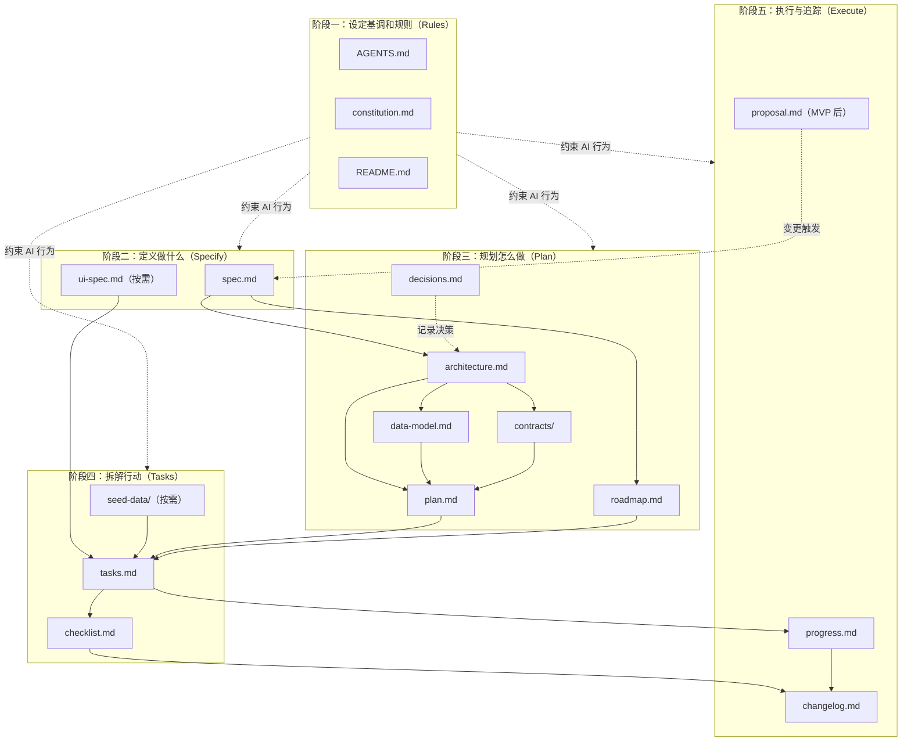

# Agentic Engineering + SDD 开发体系文档指南

> 本指南覆盖了从**规则设定（Rules）→ 需求定义（Specify）→ 架构规划（Plan）→ 任务拆解（Tasks）→ 执行追踪（Execute）**的五阶段全流程，以契合 Agentic Engineering + SDD（Spec-Driven Development）的开发理念。

---

## 文档流程图



---

## 阶段一：设定基调和规则（Rules）

> 在任何开发工作开始之前，先为 AI 和团队设定不可变的约束和上下文。

| 文档名称 | 文档作用 | 文档内容 | 编写规范 | 用法说明 |
| :--- | :--- | :--- | :--- | :--- |
| `AGENTS.md` | **AI 行为契约**，确保 AI 跨会话编码行为一致、可控、可复现。 | 编码原则（先思考再编码、保持简单、精准修改、定义可验证目标）、代码风格约定、测试命令、Git 规范、输出格式要求。 | 每条规则须具体可执行，避免模糊描述；建议控制在 300 行以内。 | 项目启动时首先创建；文件名因工具而异：Claude Code 用 `CLAUDE.md`，Cursor 用 `.cursorrules`，通用标准为 `AGENTS.md`（Copilot / Gemini CLI 等均支持）；有新编码约定时及时更新。 |
| `constitution.md` | **最高指导原则**，约束所有人类与 AI 的决策，防止架构漂移。 | 不可妥协的技术原则（如"只用 Python"、"禁止引入外部依赖"、"测试覆盖率 ≥ 80%"）、质量红线、安全要求、架构约束。 | 每条原则须有明确的执行标准（可量化或可判断）；内容一旦确定，非重大变更不得修改。 | 所有技术决策前优先参考；AI 执行每个任务前应读取此文件；若使用 GitHub Spec Kit，约定路径为 `.specify/memory/constitution.md`。 |
| `README.md` | 为 AI 和新成员提供项目高层上下文，是所有人进入项目的第一个文档。 | 项目背景与目标、技术栈概览、环境搭建步骤、快速启动指南、核心文档索引。 | 环境搭建步骤须可一键执行（复制粘贴即可运行）；内容保持简洁，细节链接到对应文档。 | 项目初始化时首先创建；技术栈或启动流程变更时同步更新；新成员 onboarding 的第一步。 |

---

## 阶段二：定义做什么（Specify）

> 聚焦"要构建什么"和"怎么验收"，不涉及任何技术实现细节。

| 文档名称 | 文档作用 | 文档内容 | 编写规范 | 用法说明 |
| :--- | :--- | :--- | :--- | :--- |
| `spec.md` | **唯一真理来源**，驱动开发与测试。所有实现必须可追溯至此文档的具体条目。 | 用户故事、功能与非功能需求、验收标准、业务规则、边界条件、流程图。 | 每个功能点须有唯一编号（如 F-001）；验收标准推荐 Given/When/Then 格式。 | 编码开始前必须完成；AI 生成代码时引用对应条目编号；需求变更时先修改此文档，再驱动 plan / tasks 更新。 |
| `ui-spec.md` *(按需，有前端时必需)* | **UI 实现契约**，消除 AI 在视觉层的猜测，确保所有界面组件风格一致。 | 配色方案、字体家族与字号层级、组件层级与命名规范、页面路由清单、响应式断点定义、交互状态定义。 | 配色须使用 Hex 值，避免"蓝色"等模糊描述；交互状态须覆盖 Loading / Error / Empty / Success 四种。 | 有前端的项目必须在编码前完成；AI 实现任何 UI 组件时强制参考。 |

---

## 阶段三：规划怎么做（Plan）

> 基于 spec 制定技术方案，回答"用什么技术、怎么构建、先做什么"。

| 文档名称 | 文档作用 | 文档内容 | 编写规范 | 用法说明 |
| :--- | :--- | :--- | :--- | :--- |
| `architecture.md` | 系统**骨架蓝图**，定义模块边界与通信协议，指导所有模块的技术方案。 | 系统结构图、模块划分与职责边界、通信方式（同步/异步/事件驱动）、数据流向、关键技术决策说明。 | 推荐使用 C4 模型绘制系统结构图；模块边界须清晰，不得出现循环依赖。 | spec 完成后编写；所有模块设计必须符合此文档定义的边界；重大架构变更须同步更新。 |
| `data-model.md` | **数据持久化权威模型**，定义持久化层的完整结构，指导 ORM 配置与迁移脚本生成。 | 数据库 ER 图、表结构与字段定义、索引策略、数据迁移方案、软删除/审计字段约定。 | 字段定义须包含类型、约束、默认值。 | 架构确定后编写；每次 Schema 变更后同步更新；AI 生成 ORM 模型或迁移脚本时参考。 |
| `contracts/` | 所有服务间通信的**硬契约**（前后端、微服务间、第三方集成均适用），可自动生成文档、mock server 与测试桩。 | 接口路径、HTTP 方法、请求/响应结构、错误码定义、鉴权方式。 | 按服务或业务域分文件组织（如 `user-api.yaml`、`payment-api.yaml`）；采用 OpenAPI / Swagger 或 GraphQL Schema 格式。 | 架构和数据模型确定后编写；接口变更须先更新契约文件，再修改实现；可使用工具自动生成 mock server 和客户端代码。 |
| `plan.md` | 连接架构与任务拆解的**桥梁**，将技术方案转化为可执行的实施路径。 | 技术栈细化（含版本）、模块实现顺序、第三方服务集成方案、错误处理与日志策略、关键业务流程的实现思路。 | 聚焦"怎么实现"，不重复 architecture 已有的架构决策；API 接口设计由 `contracts/` 承担，此处只描述实现思路，不重复接口定义。 | 架构文档完成后编写；AI 拆解 tasks 时以此为主要输入。 |
| `decisions.md` | 保存"为什么这样做"的**决策记忆库**，避免重复讨论，支持未来回溯。 | 每条 ADR 包含：背景/问题描述、备选方案对比、最终决策及理由、潜在风险及缓解措施、决策时间。 | 只追加，不删除历史记录（可标注"已废弃"）；应在决策当时记录，避免事后补写导致细节丢失。 | 每次做出重要技术决策时追加记录；AI 遇到选型问题时首先查阅。 |
| `roadmap.md` | **交付路线图**，在里程碑层面规划产品交付节奏，将 spec 中的功能集合拆解为可迭代的阶段目标。 | 里程碑划分（含目标与时间）、MVP 范围定义、各迭代周期的交付目标与优先级排序、依赖关系说明。 | 里程碑粒度不宜过细，原子任务由 `tasks.md` 承担。 | spec 确定后、tasks 拆解前完成；用于把控整体交付节奏；里程碑完成时更新状态。 |

---

## 阶段四：拆解行动（Tasks）

> 将方案拆解为原子任务，提供测试数据，设定质量关卡。

| 文档名称 | 文档作用 | 文档内容 | 编写规范 | 用法说明 |
| :--- | :--- | :--- | :--- | :--- |
| `seed-data/` | 为集成测试与 E2E 测试提供**可运行的基础数据**，是 AI Agent 验证实现正确性的必要支撑。 | 正常场景数据、边界值数据、异常场景数据，覆盖主要业务流程。 | 采用结构化格式（JSON / SQL / YAML / CSV）；文件命名应体现场景含义（如 `user-normal.json`、`order-edge-cases.sql`）；数据须贴近真实业务，避免无意义占位符。 | 按需（有集成测试或 E2E 测试时必需）；在编写 tasks 前准备好；本地开发环境和 CI/CD 流水线中自动加载。 |
| `tasks.md` | AI 编码的**行动清单**，将 plan 转化为可逐条执行的最小工作单元，减少幻觉，提升实现可控性。 | 每条任务包含：任务描述、关联 spec 条目编号、预估复杂度、前置依赖任务、验收方法。 | 任务粒度以 30min-2h 为宜（S/M/L）；验收方法须为可运行的测试命令或可验证步骤，不得写"测试通过"等模糊描述。 | 基于 plan.md 拆解；AI 每次只执行一条 task；每条完成后在此处勾选，不允许批量执行。 |
| `checklist.md` | **质量关卡**，聚焦跨任务的系统级验收，与 `spec.md` / `tasks.md` 的单功能验收形成互补。 | 安全审查项（输入验证、鉴权、敏感数据）、性能基准测试项、兼容性测试项、部署验证项、回归测试项。 | 每项须有明确的通过/失败判断标准，避免"功能正常"等模糊标准；部分条目应配置 CI 自动检查。 | 每次发布前必须逐项核查；未通过任意一项不得发布。 |

---

## 阶段五：执行与追踪（Execute）

> 逐项执行任务，持续追踪状态，管理 MVP 后的变更。

| 文档名称 | 文档作用 | 文档内容 | 编写规范 | 用法说明 |
| :--- | :--- | :--- | :--- | :--- |
| `progress.md` | 项目**在途状态**仪表盘，支持回溯与现场审计。 | 各任务当前状态、遗留问题与负责人、测试结果摘要、阻塞原因及预计解除时间。 | 任务状态枚举：待做 / 进行中 / 完成 / 阻塞；出现阻塞时必须记录原因和负责人，不得留空。 | 每条 task 完成后立即更新；出现阻塞时立即记录；作为团队每日同步的信息源。 |
| `changelog.md` | 记录"已交付成果"的历史档案，与 `progress.md`（在途）形成互补，支持长周期回溯。 | 版本号、发布日期、新增功能、问题修复、重大变更、废弃项。 | 遵循 [Keep a Changelog](https://keepachangelog.com) 格式；按时间倒序追加；历史记录不得删改（已废弃内容可标注删除线）。 | 每次里程碑完成或版本发布时更新；是对外沟通和长期回溯的主要参考。 |
| `proposal.md` | 管理功能演进，保证每次需求增/删/改都有记录与评审，防止"悄悄改需求"。 | 变更动机与背景、影响范围分析（波及的 spec 条目、API 接口、数据模型）、实施方案、评审状态。 | 评审状态须明确（草稿/通过/拒绝）。 | MVP 发布后出现新需求时创建；评审通过后按 SDD 标准流程触发级联更新：proposal → 修改 spec → 重新 plan → 重新 tasks。 |

---

## 补充：自动化与元数据

| 文档名称 | 文档作用 | 文档内容 | 编写规范 | 用法说明 |
| :--- | :--- | :--- | :--- | :--- |
| `.specify/` 目录 | 支撑 SDD 流程自动化的基础设施。**注：仅适用于 GitHub Spec Kit 工具链。** | `memory/`（存放 constitution.md）、`templates/`（各类文档的结构模板）、`scripts/`（自动化辅助脚本）。 | 由工具脚手架自动生成，通常无需手动编辑；如需定制，仅修改 `templates/` 下的模板文件。 | 通过 `specify init <PROJECT_NAME>` 自动生成；使用 slash 命令（如 `/specify`、`/plan`）触发自动化流程。 |
| `manifest.md` | 为工具链和团队提供可解析的文档地图，支持自动化依赖分析。 | 所有核心文档的路径、版本号、创建/更新时间、当前状态、文档间关联关系。 | 状态枚举：草稿/已评审/已实施；关联关系以"文档A → 关系 → 文档B"格式表达（如"spec.md → 驱动 → tasks.md"）。 | 每新增或修改核心文档时同步更新；自动化工具可扫描此文件获取文档状态。 |

---

## 项目目录结构参考

> 以下展示 SDD 文档在实际项目中的推荐目录布局。文档按五阶段归类，与源代码共同版本化管理。

### 完整项目结构（适用于 L / XL 复杂度项目）

```
your-project/
│
├── AGENTS.md                           # [Rules] AI 编码行为契约
├── constitution.md                     # [Rules] 最高技术约束与质量红线
├── README.md                           # [Rules] 项目入口文档
├── CHANGELOG.md                        # [Execute] 已交付成果的历史档案
│
├── docs/                               # ── SDD 文档体系 ──
│   ├── spec.md                         # [Specify] 需求规范（唯一真理来源）
│   ├── ui-spec.md                      # [Specify] UI 实现契约（按需）
│   │
│   ├── architecture.md                 # [Plan] 系统架构蓝图
│   ├── data-model.md                   # [Plan] 数据持久化模型
│   ├── plan.md                         # [Plan] 技术实施路径
│   ├── decisions.md                    # [Plan] 架构决策记录（ADR）
│   ├── roadmap.md                      # [Plan] 交付路线图
│   │
│   ├── tasks.md                        # [Tasks] 原子化行动清单
│   ├── checklist.md                    # [Tasks] 发布前质量关卡
│   │
│   ├── progress.md                     # [Execute] 在途状态仪表盘
│   ├── proposal.md                     # [Execute] 变更提案（MVP 后）
│   └── manifest.md                     # [补充] 文档地图与元数据
│
├── contracts/                          # ── API 硬契约 ──
│   ├── user-api.yaml                   # 用户服务接口定义
│   ├── order-api.yaml                  # 订单服务接口定义
│   └── payment-api.yaml               # 支付服务接口定义
│
├── seed-data/                          # ── 测试基础数据（按需） ──
│   ├── users-normal.json               # 正常场景用户数据
│   ├── users-edge-cases.json           # 边界值用户数据
│   └── orders-error-scenarios.sql      # 异常场景订单数据
│
├── .specify/                           # ── SDD 自动化基础设施（按需） ──
│   ├── memory/                         # 持久化记忆（如 constitution.md 副本）
│   ├── templates/                      # 文档结构模板
│   └── scripts/                        # 自动化辅助脚本
│
├── src/                                # ── 源代码 ──
│   └── ...                             # （结构因技术栈而异）
│
├── tests/                              # ── 测试代码 ──
│   ├── unit/                           # 单元测试
│   ├── integration/                    # 集成测试
│   └── e2e/                            # 端到端测试
│
├── .env.example                        # 环境变量模板
├── .gitignore
└── [依赖配置文件]                       # 如 pyproject.toml / package.json / go.mod
```

### MVP 最小结构（适用于 S / M 复杂度项目）

```
your-project/
│
├── AGENTS.md                           # [Rules] AI 编码行为契约
├── README.md                           # [Rules] 项目入口文档
│
├── docs/
│   ├── spec.md                         # [Specify] 需求规范
│   └── tasks.md                        # [Tasks] 原子化行动清单
│
├── src/                                # 源代码
│   └── ...
├── tests/                              # 测试代码
│   └── ...
│
└── [依赖配置文件]                       # 如 pyproject.toml / package.json / go.mod
```

### 目录布局说明

| 位置 | 放置的文档 | 放置原因 |
| :--- | :--- | :--- |
| **项目根目录** | `AGENTS.md`、`constitution.md`、`README.md`、`CHANGELOG.md` | 根目录文件对 AI 工具具有最高可见性，确保每次会话自动加载 |
| **`docs/`** | spec、architecture、plan、tasks 等核心 SDD 文档 | 集中管理，与源代码平级但分离，避免根目录过于拥挤 |
| **`contracts/`** | OpenAPI / GraphQL Schema 等 API 契约文件 | 独立目录便于工具链自动生成 mock server、客户端代码和文档 |
| **`seed-data/`** | JSON / SQL / YAML 格式的测试基础数据 | 独立目录便于 CI/CD 流水线和本地开发环境统一加载 |
| **`.specify/`** | memory、templates、scripts（按需） | 仅适用于 GitHub Spec Kit 工具链，支撑 SDD 流程自动化 |

> **提示**：以上为推荐布局，团队可根据实际技术栈和工具链调整。关键原则是：(1) AI 行为约束文件置于根目录以确保自动加载；(2) SDD 文档集中存放于 `docs/` 以保持可管理性；(3) 文档与代码同仓库、同版本化。