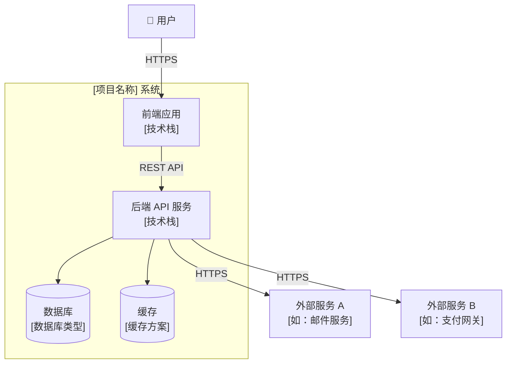
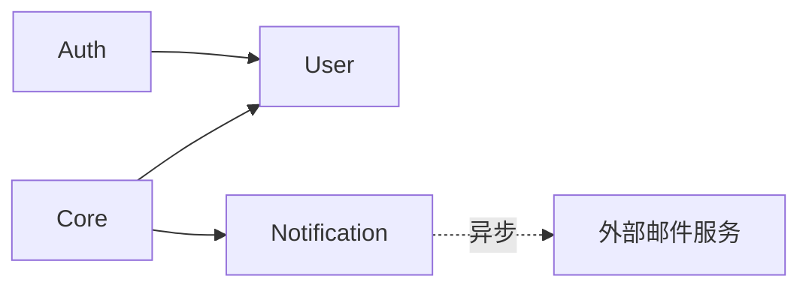

# architecture.md — 系统架构蓝图

> **所属阶段**：Plan（阶段三）
> **前置依赖**：spec.md 完成后编写
> **更新时机**：重大架构变更时同步更新

---

## 系统架构图

> 推荐使用 C4 模型。下方为 Context 层示例，可按需展开至 Container / Component 层。



---

## 模块划分与职责

| 模块 | 职责边界 | 对外接口 | 技术选型 |
| :--- | :--- | :--- | :--- |
| [模块A，如 Auth] | [如：用户认证、授权、会话管理] | [如：REST API /api/auth/*] | [如：JWT + bcrypt] |
| [模块B，如 User] | [如：用户资料 CRUD、偏好设置] | [如：REST API /api/users/*] | [如：SQLAlchemy ORM] |
| [模块C，如 Core] | [如：核心业务逻辑] | [如：REST API /api/core/*] | [如：领域驱动设计] |
| [模块D，如 Notification] | [如：消息通知、邮件发送] | [如：内部事件驱动] | [如：Celery + SMTP] |

### 模块依赖关系



> ⚠️ 模块间禁止循环依赖。依赖方向须严格遵守上图。

---

## 通信方式

### 同步调用

| 调用方 | 被调用方 | 协议 | 场景 |
| :--- | :--- | :--- | :--- |
| 前端 | 后端 API | REST / HTTPS | 所有用户请求 |
| [模块A] | [模块B] | 函数调用 | [场景描述] |

### 异步消息（如适用）

| 生产者 | 消费者 | 消息队列 | 场景 |
| :--- | :--- | :--- | :--- |
| [模块A] | [模块B] | [如 Redis Queue / RabbitMQ] | [如：发送邮件通知] |

### 事件驱动（如适用）

| 事件名称 | 发布者 | 订阅者 | 触发条件 |
| :--- | :--- | :--- | :--- |
| `user.registered` | Auth 模块 | Notification 模块 | 用户注册成功时 |

---

## 数据流向

```
用户请求 → 前端 → API 网关/路由 → 业务逻辑层 → 数据访问层 → 数据库
                                      ↓
                                  缓存层（读取热点数据）
                                      ↓
                                  外部服务（按需调用）
```

---

## 关键技术决策

> 详细的决策推导过程记录在 `decisions.md`，此处仅列出结论。

| 决策项 | 选择 | 理由摘要 | ADR 编号 |
| :--- | :--- | :--- | :--- |
| [如：Web 框架] | [如：FastAPI] | [如：异步支持好，性能优秀] | ADR-001 |
| [如：ORM] | [如：SQLAlchemy 2.0] | [如：生态成熟，类型安全] | ADR-002 |
| [如：认证方案] | [如：JWT] | [如：无状态，适合 API] | ADR-003 |

---

## 架构级质量考量

> 通用质量红线（性能基线、安全要求、测试覆盖率）统一在 `constitution.md` 中定义，此处仅列出**本架构特有的**考量。

- **可扩展性**：[如：模块 X 预留水平扩展接口]
- **可观测性**：[如：结构化日志 + 请求链路追踪（request_id 贯穿全链路）]
- **容错边界**：[如：外部服务 A 不可用时，模块 X 降级为本地缓存模式]
- **数据一致性**：[如：跨模块操作使用事务 / 最终一致性策略]
