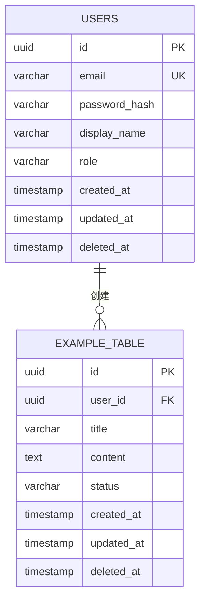

# data-model.md — 数据持久化权威模型

> **所属阶段**：Plan（阶段三）
> **前置依赖**：architecture.md 确定后编写
> **更新时机**：每次 Schema 变更后必须同步更新
> **关联约束**：AI 修改数据库 Schema 时，必须先更新本文件（见 AGENTS.md 禁止行为）

---

## ER 关系图

---

## 表结构定义

### users — 用户表

| 字段 | 类型 | 约束 | 默认值 | 说明 |
| :--- | :--- | :--- | :--- | :--- |
| `id` | UUID | PK, NOT NULL | `gen_random_uuid()` | 主键 |
| `email` | VARCHAR(255) | UNIQUE, NOT NULL | — | 登录邮箱 |
| `password_hash` | VARCHAR(255) | NOT NULL | — | 密码哈希（bcrypt） |
| `display_name` | VARCHAR(100) | NOT NULL | — | 显示名称 |
| `role` | VARCHAR(20) | NOT NULL | `'user'` | 角色：user / admin |
| `created_at` | TIMESTAMP | NOT NULL | `NOW()` | 创建时间 |
| `updated_at` | TIMESTAMP | NOT NULL | `NOW()` | 更新时间 |
| `deleted_at` | TIMESTAMP | NULLABLE | `NULL` | 软删除标记 |

**索引**：
- `idx_users_email` — UNIQUE on `email`（登录查询）
- `idx_users_role` — on `role`（按角色筛选）

---

### [example_table] — [表描述]

| 字段 | 类型 | 约束 | 默认值 | 说明 |
| :--- | :--- | :--- | :--- | :--- |
| `id` | UUID | PK, NOT NULL | `gen_random_uuid()` | 主键 |
| `user_id` | UUID | FK → users.id, NOT NULL | — | 所属用户 |
| `title` | VARCHAR(200) | NOT NULL | — | 标题 |
| `content` | TEXT | NULLABLE | — | 内容 |
| `status` | VARCHAR(20) | NOT NULL | `'draft'` | 状态枚举 |
| `created_at` | TIMESTAMP | NOT NULL | `NOW()` | 创建时间 |
| `updated_at` | TIMESTAMP | NOT NULL | `NOW()` | 更新时间 |
| `deleted_at` | TIMESTAMP | NULLABLE | `NULL` | 软删除标记 |

**索引**：
- `idx_example_user_id` — on `user_id`（按用户查询）
- `idx_example_status` — on `status`（按状态筛选）

---

## 通用约定

### 审计字段

所有表必须包含以下字段：
- `created_at`：记录创建时间，NOT NULL，默认 `NOW()`
- `updated_at`：记录更新时间，NOT NULL，默认 `NOW()`，每次更新自动刷新

### 软删除

- 使用 `deleted_at` 字段标记删除，`NULL` 表示未删除
- 查询时默认过滤 `WHERE deleted_at IS NULL`
- 禁止物理删除用户数据（见 constitution.md）

### 主键策略

- 默认推荐 UUID v4（避免 ID 枚举攻击，适合分布式场景）
- 生成方式：[如 PostgreSQL `gen_random_uuid()` / 应用层 `uuid4()` / ULID]
- 如项目有特殊需求（如高写入性能），可选用自增 ID 或 ULID，须在 `decisions.md` 中记录理由

---

## 数据迁移策略

- 迁移工具：[如 Alembic / Prisma Migrate / Flyway]
- 命名规范：`YYYYMMDD_HHMMSS_<描述>.sql`
- 每个迁移必须包含 UP 和 DOWN 脚本
- 迁移脚本提交前必须在本地测试回滚

---

## 枚举值定义

| 表 | 字段 | 可选值 | 说明 |
| :--- | :--- | :--- | :--- |
| users | role | `user`, `admin` | 用户角色 |
| [表名] | status | `draft`, `active`, `archived` | [说明] |
