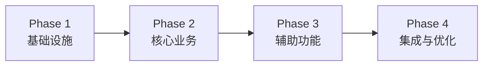

# plan.md — 技术实施路径

> **所属阶段**：Plan（阶段三）
> **前置依赖**：architecture.md + data-model.md + contracts/ 完成后编写
> **性质**：连接架构与任务拆解的桥梁，聚焦"怎么实现"
> **更新时机**：技术方案调整时同步更新

---

## 技术栈细化

> 核心技术栈约束（语言、主框架、数据库）在 `constitution.md` 中定义。此处细化**版本锁定**和**辅助工具链**。

| 类别 | 技术 | 版本 | 用途 |
| :--- | :--- | :--- | :--- |
| 运行时 | [如 Python] | [如 3.12.x] | 服务端运行时（见 constitution） |
| Web 框架 | [如 FastAPI] | [如 0.115.2] | HTTP 路由与请求处理（见 constitution） |
| ORM | [如 SQLAlchemy] | [如 2.0.35] | 数据库访问 |
| 迁移工具 | [如 Alembic] | [如 1.13.1] | Schema 版本管理 |
| 任务队列 | [如 Celery] | [如 5.4]（如适用） | 异步任务处理 |
| 测试框架 | [如 pytest] | [如 8.3.x] | 自动化测试 |
| 容器化 | [如 Docker] | [如 24.x] | 环境一致性 |

---

## 模块实现顺序

> 此处定义**技术层面的实现先后顺序**（先搭什么、再建什么），聚焦依赖链。
> 业务层面的**交付时间线和里程碑规划**由 `roadmap.md` 承担，两者互补但不重复。



### Phase 1：基础设施搭建

1. 项目脚手架初始化（目录结构、依赖管理、配置系统）
2. 数据库连接与 ORM 配置
3. 数据库迁移脚手架
4. 基础中间件（日志、错误处理、CORS）
5. 健康检查端点

### Phase 2：核心业务实现

1. [核心模块A，如：用户认证（注册/登录/Token管理）]
2. [核心模块B，如：核心业务 CRUD]
3. [核心模块C，如：权限控制]

### Phase 3：辅助功能

1. [辅助功能A，如：邮件通知]
2. [辅助功能B，如：文件上传]
3. [辅助功能C，如：数据导出]

### Phase 4：集成与优化

1. 端到端测试
2. 性能优化（缓存、查询优化）
3. 部署配置（Docker / CI/CD）

---

## 第三方服务集成方案

| 服务 | 提供商 | 用途 | 集成方式 | 容错策略 |
| :--- | :--- | :--- | :--- | :--- |
| [如 邮件] | [如 SendGrid] | 验证邮件/通知 | REST API | 失败重试 3 次，超时 10s |
| [如 存储] | [如 S3] | 文件/图片存储 | SDK | 本地 fallback |
| [如 支付] | [如 Stripe] | 订单支付 | Webhook | 幂等处理 |

---

## 错误处理策略

### 全局错误处理

```
请求 → 中间件捕获异常 → 统一错误响应格式 → 日志记录
```

### 错误分级

| 级别 | 处理方式 | 示例 |
| :--- | :--- | :--- |
| 业务错误 | 返回具体错误码，前端展示 | 邮箱已注册、余额不足 |
| 校验错误 | 返回 422 + 字段级错误详情 | 必填字段缺失、格式错误 |
| 系统错误 | 返回 500，日志告警 | 数据库连接失败、第三方超时 |

### 日志策略

- 格式：JSON 结构化日志
- 级别：ERROR / WARN / INFO / DEBUG
- 必记字段：`timestamp`, `level`, `request_id`, `module`, `message`
- 敏感信息（密码、Token）禁止出现在日志中

---

## 关键业务流程实现思路

### [流程名称，如：用户注册流程]

```
1. 接收注册请求 → 参数校验
2. 检查邮箱是否已注册 → 若已注册返回 409
3. 密码哈希处理（bcrypt）
4. 写入数据库
5. 触发「发送验证邮件」异步任务
6. 返回用户信息（不含密码）
```

### [流程名称，如：订单支付流程]

```
[按实际业务流程填写]
```

---

> **注意**：API 接口的具体定义（路径、请求/响应结构）由 `contracts/` 承担，本文件不重复。
