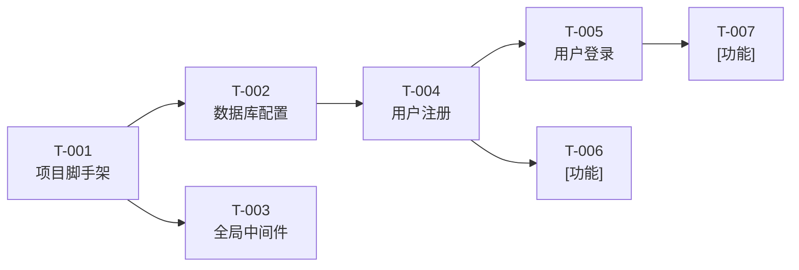

# tasks.md — 原子化行动清单

> **所属阶段**：Tasks（阶段四）
> **前置依赖**：基于 plan.md + roadmap.md 拆解
> **执行规则**：AI 每次只执行一条 task，完成后在此处勾选，不允许批量执行
> **粒度规范**：S（30min-1h）/ M（1-2h）/ L（2-4h）/ XL（4h+，须拆分或经人类审批），验收方法须为可运行的命令

---

## 当前迭代：[里程碑名称，如 M2 - 核心功能 MVP]

### 基础设施

- [ ] **T-001**：初始化项目脚手架（关联 M1）
  - 描述：创建项目目录结构、安装核心依赖、配置 linter/formatter
  - 涉及文件：`pyproject.toml`、`src/__init__.py`、`.ruff.toml`
  - 验收：`[测试命令，如 python -c "import fastapi; print(fastapi.__version__)"]` 正常输出版本号
  - 复杂度：S | 依赖：无

- [ ] **T-002**：配置数据库连接与 ORM（关联 M1）
  - 描述：配置数据库连接池、创建 Base Model、设置 Alembic 迁移
  - 涉及文件：`src/database.py`、`src/models/base.py`、`alembic/`
  - 验收：`[如 alembic upgrade head]` 执行成功 + `[如 pytest tests/test_db.py -v]` 全部通过
  - 复杂度：M | 依赖：T-001

- [ ] **T-003**：实现全局中间件（关联 M1）
  - 描述：错误处理中间件、请求日志中间件、CORS 配置
  - 涉及文件：`src/middleware/`、`src/main.[ext]`
  - 验收：`[如 curl http://localhost:8000/health]` 返回 200 + 日志输出正确
  - 复杂度：S | 依赖：T-001

### 核心业务

- [ ] **T-004**：实现用户注册 API（关联 F-001，AC-001-01~03）
  - 描述：POST /api/auth/register，包含参数校验、邮箱唯一性检查、密码哈希、数据库写入
  - 涉及文件：`src/auth/router.py`、`src/auth/service.py`、`tests/test_auth.py`
  - 验收：`[如 pytest tests/test_auth.py::test_register -v]` 全部通过
  - 复杂度：M | 依赖：T-002

- [ ] **T-005**：实现用户登录 API（关联 F-002，AC-002-01~02）
  - 描述：POST /api/auth/login，包含凭据验证、JWT Token 生成
  - 涉及文件：`src/auth/router.py`、`src/auth/jwt.py`、`tests/test_auth.py`
  - 验收：`[如 pytest tests/test_auth.py::test_login -v]` 全部通过
  - 复杂度：M | 依赖：T-004

- [ ] **T-006**：[功能描述]（关联 F-XXX，AC-XXX-XX）
  - 描述：[具体实现内容]
  - 涉及文件：[需要创建/修改的文件列表]
  - 验收：`[测试命令]`
  - 复杂度：[S/M/L/XL] | 依赖：[T-XXX]

### 辅助功能

- [ ] **T-007**：[功能描述]（关联 F-XXX）
  - 描述：[具体实现内容]
  - 涉及文件：[需要创建/修改的文件列表]
  - 验收：`[测试命令]`
  - 复杂度：[S/M/L/XL] | 依赖：[T-XXX]

---

## 任务依赖关系

---

## 统计

| 复杂度 | 数量 | 预估总耗时 | 流程要求 |
| :--- | :--- | :--- | :--- |
| S（30min-1h） | [X] 个 | [X]h | AGENTS.md 即可 |
| M（1-2h） | [X] 个 | [X]h | 须关联 spec + tasks |
| L（2-4h） | [X] 个 | [X]h | 须走完整五阶段 |
| XL（4h+） | [X] 个 | [X]h | 完整五阶段 + decisions + 安全审查 |
| **合计** | **[X] 个** | **[X]h** | |

---

<!--
模板提示：
- 编号规则：T-XXX，递增，不重复
- 每条 task 必须关联 spec 中的功能编号（F-XXX）或验收标准（AC-XXX-XX）
- 验收方法禁止写"测试通过"等模糊描述，必须是可运行的命令
- 新增任务时追加到对应分类下，更新统计和依赖图
-->
