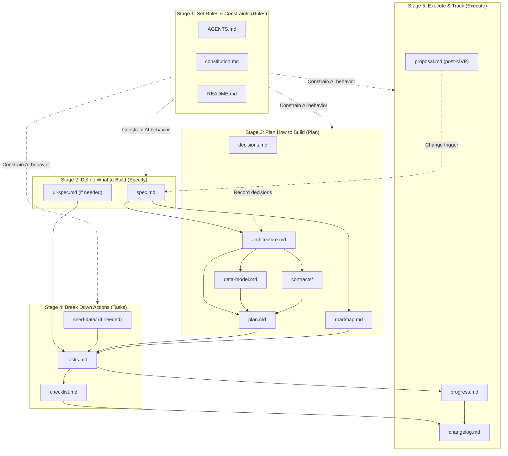

# Agentic Engineering + SDD Document Guide

> This guide covers the full five-stage workflow from **Rules → Specify → Plan → Tasks → Execute**, aligned with the Agentic Engineering + SDD (Spec-Driven Development) methodology.

---

## Document Flow Diagram



---

## Stage 1: Set Rules & Constraints (Rules)

> Before any development begins, establish immutable constraints and context for AI and the team.

| Document | Purpose | Content | Writing Guidelines | Usage |
| :--- | :--- | :--- | :--- | :--- |
| `AGENTS.md` | **AI Behavior Contract** — ensures consistent, controllable, and reproducible AI coding behavior across sessions. | Coding principles (think before coding, keep it simple, precise edits, define verifiable goals), code style conventions, test commands, Git standards, output format requirements. | Each rule must be specific and actionable; avoid vague descriptions. Recommended limit: 300 lines. | Create first when starting a project. File name varies by tool: Claude Code uses `CLAUDE.md`, Cursor uses `.cursorrules`, universal standard is `AGENTS.md` (supported by Copilot, Gemini CLI, etc.). Update whenever new coding conventions are established. |
| `constitution.md` | **Highest Guiding Principles** — constrains all human and AI decisions, preventing architectural drift. | Non-negotiable technical principles (e.g., "Python only", "no external dependencies", "test coverage ≥ 80%"), quality baselines, security requirements, architectural constraints. | Each principle must have a clear, measurable enforcement standard. Once established, changes require significant justification. | Consult before all technical decisions. AI should read this file before executing each task. If using GitHub Spec Kit, convention path is `.specify/memory/constitution.md`. |
| `README.md` | Provides high-level project context for AI and new team members — the first document everyone reads when entering a project. | Project background and goals, technology stack overview, environment setup steps, quick-start guide, core document index. | Environment setup steps must be runnable with copy-paste; keep content concise and link details to corresponding documents. | Create first when initializing a project. Update whenever the tech stack or startup process changes. First step for onboarding new team members. |

---

## Stage 2: Define What to Build (Specify)

> Focus on "what to build" and "how to validate", with no technical implementation details.

| Document | Purpose | Content | Writing Guidelines | Usage |
| :--- | :--- | :--- | :--- | :--- |
| `spec.md` | **Single Source of Truth** — drives development and testing. All implementations must be traceable to specific entries in this document. | User stories, functional and non-functional requirements, acceptance criteria, business rules, edge cases, flow diagrams. | Each feature must have a unique ID (e.g., F-001). Acceptance criteria should use Given/When/Then format. | Must be completed before coding begins. AI references corresponding entry IDs when generating code. When requirements change, update this document first, then drive plan/tasks updates. |
| `ui-spec.md` *(required when frontend exists)* | **UI Implementation Contract** — eliminates AI guesswork at the visual layer, ensuring consistent style across all interface components. | Color scheme, font families and size hierarchy, component hierarchy and naming conventions, page route list, responsive breakpoints, interaction state definitions. | Colors must use Hex values; avoid vague descriptions like "blue". Interaction states must cover all four: Loading / Error / Empty / Success. | Required before coding any frontend project. AI must reference this when implementing any UI component. |

---

## Stage 3: Plan How to Build (Plan)

> Create the technical plan based on the spec, answering "what tech to use, how to build it, and what to do first".

| Document | Purpose | Content | Writing Guidelines | Usage |
| :--- | :--- | :--- | :--- | :--- |
| `architecture.md` | **System Blueprint** — defines module boundaries and communication protocols, guides all technical decisions. | System structure diagram, module division and responsibility boundaries, communication patterns (sync/async/event-driven), data flows, key technical decision notes. | Recommend using C4 model for system diagrams. Module boundaries must be clear; circular dependencies are not allowed. | Write after spec is complete. All module designs must conform to boundaries defined here. Update for major architectural changes. |
| `data-model.md` | **Authoritative Persistence Model** — defines the complete persistence layer structure, guiding ORM configuration and migration script generation. | Database ER diagrams, table structure and field definitions, index strategies, data migration plans, soft-delete/audit field conventions. | Field definitions must include type, constraints, and default values. | Write after architecture is confirmed. Update after every Schema change. AI references this when generating ORM models or migration scripts. |
| `contracts/` | **Hard Contracts** for all inter-service communication (frontend-backend, microservices, third-party integrations). Can auto-generate docs, mock servers, and test stubs. | Interface paths, HTTP methods, request/response structures, error codes, authentication methods. | Organize by service or business domain (e.g., `user-api.yaml`, `payment-api.yaml`). Use OpenAPI/Swagger or GraphQL Schema format. | Write after architecture and data model are confirmed. Update contract files before modifying implementations. Use tools to auto-generate mock servers and client code. |
| `plan.md` | **Bridge** between architecture and task breakdown — translates technical design into an executable implementation path. | Tech stack details (with versions), module implementation order, third-party service integration plan, error handling and logging strategy, key business flow implementation approach. | Focus on "how to implement"; don't repeat architectural decisions already in architecture.md. API interface design is handled by `contracts/`, not here. | Write after architecture documents are complete. AI uses this as the primary input when breaking down tasks. |
| `decisions.md` | **Decision Memory Bank** — records "why we did it this way", avoiding repeated discussions and enabling future traceability. | Each ADR includes: background/problem description, alternative comparison, final decision and rationale, potential risks and mitigation, decision date. | Append-only; never delete history (can mark as "deprecated"). Record at decision time; don't write retrospectively. | Append a new entry whenever an important technical decision is made. AI should check this first when facing technology selection questions. |
| `roadmap.md` | **Delivery Roadmap** — plans the product delivery cadence at milestone level, breaking spec features into iterative stage goals. | Milestone breakdown (with goals and dates), MVP scope definition, delivery goals and priority ordering for each iteration, dependency notes. | Milestones should not be too granular; atomic tasks are handled by `tasks.md`. | Complete after spec is confirmed and before task breakdown. Used to manage overall delivery pace. Update status when milestones are completed. |

---

## Stage 4: Break Down Actions (Tasks)

> Break down the plan into atomic tasks, provide test data, and set quality gates.

| Document | Purpose | Content | Writing Guidelines | Usage |
| :--- | :--- | :--- | :--- | :--- |
| `seed-data/` | Provides **runnable baseline data** for integration tests and E2E tests — essential support for AI agents to verify implementation correctness. | Normal scenario data, boundary value data, error scenario data covering major business flows. | Use structured formats (JSON / SQL / YAML / CSV). File names should reflect scenario meaning (e.g., `user-normal.json`, `order-edge-cases.sql`). Data should be realistic; avoid meaningless placeholders. | Required when integration or E2E tests exist. Prepare before writing tasks. Auto-loaded in local dev environments and CI/CD pipelines. |
| `tasks.md` | **Action Checklist** for AI coding — transforms the plan into minimum executable work units, reducing hallucinations and improving controllability. | Each task includes: task description, linked spec entry ID, estimated complexity, prerequisite tasks, acceptance method. | Task granularity should be 30min–2h (S/M/L). Acceptance methods must be runnable test commands or verifiable steps; never write vague descriptions like "tests pass". | Break down from plan.md. AI executes only one task at a time. Check off each task upon completion; batch execution is not allowed. |
| `checklist.md` | **Quality Gate** — focuses on system-level acceptance across tasks, complementing the per-feature acceptance in `spec.md` / `tasks.md`. | Security review items (input validation, auth, sensitive data), performance benchmark items, compatibility test items, deployment verification items, regression test items. | Each item must have a clear pass/fail criterion; avoid vague standards like "functions properly". Some items should be configured for CI auto-check. | Must be verified item by item before each release. Do not release if any item fails. |

---

## Stage 5: Execute & Track (Execute)

> Execute tasks one by one, continuously track status, manage changes post-MVP.

| Document | Purpose | Content | Writing Guidelines | Usage |
| :--- | :--- | :--- | :--- | :--- |
| `progress.md` | **In-Flight Status Dashboard** — supports traceability and on-site auditing. | Current status of each task, outstanding issues and owners, test result summaries, blocker reasons and estimated resolution times. | Task status options: Pending / In Progress / Done / Blocked. When blocked, must record reason and owner; leave no blanks. | Update immediately after each task is completed. Record blockers immediately when they occur. Serves as the team's daily sync information source. |
| `changelog.md` | Historical archive of "delivered results" — complements `progress.md` (in-flight), supports long-term retrospectives. | Version number, release date, new features, bug fixes, breaking changes, deprecations. | Follow [Keep a Changelog](https://keepachangelog.com) format. Append in reverse chronological order. Historical records must not be modified (deprecated items can be struck through). | Update whenever a milestone is completed or a version is released. Primary reference for external communication and long-term retrospectives. |
| `proposal.md` | Manages feature evolution — ensures every requirement addition/removal/modification has a record and review, preventing "silent requirement changes". | Change motivation and background, impact scope analysis (affected spec entries, API interfaces, data models), implementation plan, review status. | Review status must be explicit (Draft / Approved / Rejected). | Create when new requirements emerge after MVP release. After approval, trigger cascade updates via SDD standard workflow: proposal → update spec → re-plan → re-task. |

---

## Supplement: Automation & Metadata

| Document | Purpose | Content | Writing Guidelines | Usage |
| :--- | :--- | :--- | :--- | :--- |
| `.specify/` directory | Infrastructure supporting SDD process automation. **Note: only applicable to the GitHub Spec Kit toolchain.** | `memory/` (stores constitution.md), `templates/` (document structure templates), `scripts/` (automation helper scripts). | Auto-generated by tool scaffolding; typically no manual editing needed. To customize, only modify files under `templates/`. | Auto-generated via `specify init <PROJECT_NAME>`. Use slash commands (e.g., `/specify`, `/plan`) to trigger automation workflows. |
| `manifest.md` | Provides a parseable document map for toolchains and teams, supporting automated dependency analysis. | Paths, version numbers, creation/update dates, current status, and inter-document relationships for all core documents. | Status options: Draft / Reviewed / Implemented. Relationships expressed as "Doc A → relationship → Doc B" (e.g., "spec.md → drives → tasks.md"). | Update whenever a core document is added or modified. Automation tools can scan this file to get document status. |

---

## Project Directory Structure Reference

> The following shows the recommended directory layout for SDD documents in a real project. Documents are organized by five stages and version-controlled together with source code.

### Full Project Structure (for L / XL complexity projects)

```
your-project/
│
├── AGENTS.md                           # [Rules] AI coding behavior contract
├── constitution.md                     # [Rules] Highest technical constraints and quality baselines
├── README.md                           # [Rules] Project entry document
├── CHANGELOG.md                        # [Execute] Historical archive of delivered results
│
├── docs/                               # ── SDD Document System ──
│   ├── spec.md                         # [Specify] Requirements spec (Single Source of Truth)
│   ├── ui-spec.md                      # [Specify] UI implementation contract (if needed)
│   │
│   ├── architecture.md                 # [Plan] System architecture blueprint
│   ├── data-model.md                   # [Plan] Data persistence model
│   ├── plan.md                         # [Plan] Technical implementation path
│   ├── decisions.md                    # [Plan] Architecture decision records (ADR)
│   ├── roadmap.md                      # [Plan] Delivery roadmap
│   │
│   ├── tasks.md                        # [Tasks] Atomic action checklist
│   ├── checklist.md                    # [Tasks] Pre-release quality gate
│   │
│   ├── progress.md                     # [Execute] In-flight status dashboard
│   ├── proposal.md                     # [Execute] Change proposal (post-MVP)
│   └── manifest.md                     # [Supplement] Document map and metadata
│
├── contracts/                          # ── API Hard Contracts ──
│   ├── user-api.yaml                   # User service interface definitions
│   ├── order-api.yaml                  # Order service interface definitions
│   └── payment-api.yaml               # Payment service interface definitions
│
├── seed-data/                          # ── Test Baseline Data (if needed) ──
│   ├── users-normal.json               # Normal scenario user data
│   ├── users-edge-cases.json           # Edge case user data
│   └── orders-error-scenarios.sql      # Error scenario order data
│
├── .specify/                           # ── SDD Automation Infrastructure (if needed) ──
│   ├── memory/                         # Persistent memory (e.g., constitution.md copy)
│   ├── templates/                      # Document structure templates
│   └── scripts/                        # Automation helper scripts
│
├── src/                                # ── Source Code ──
│   └── ...                             # (structure varies by tech stack)
│
├── tests/                              # ── Test Code ──
│   ├── unit/                           # Unit tests
│   ├── integration/                    # Integration tests
│   └── e2e/                            # End-to-end tests
│
├── .env.example                        # Environment variable template
├── .gitignore
└── [dependency config file]            # e.g., pyproject.toml / package.json / go.mod
```

### MVP Minimal Structure (for S / M complexity projects)

```
your-project/
│
├── AGENTS.md                           # [Rules] AI coding behavior contract
├── README.md                           # [Rules] Project entry document
│
├── docs/
│   ├── spec.md                         # [Specify] Requirements spec
│   └── tasks.md                        # [Tasks] Atomic action checklist
│
├── src/                                # Source code
│   └── ...
├── tests/                              # Test code
│   └── ...
│
└── [dependency config file]            # e.g., pyproject.toml / package.json / go.mod
```

### Directory Layout Notes

| Location | Documents Placed | Reason |
| :--- | :--- | :--- |
| **Project root** | `AGENTS.md`, `constitution.md`, `README.md`, `CHANGELOG.md` | Root-level files have the highest visibility to AI tools, ensuring auto-loading each session |
| **`docs/`** | spec, architecture, plan, tasks and other core SDD documents | Centrally managed, at the same level as source code but separated, avoiding a cluttered root |
| **`contracts/`** | OpenAPI / GraphQL Schema and other API contract files | Separate directory enables toolchains to auto-generate mock servers, client code, and documentation |
| **`seed-data/`** | JSON / SQL / YAML format test baseline data | Separate directory for unified loading by CI/CD pipelines and local dev environments |
| **`.specify/`** | memory, templates, scripts (if needed) | Only for GitHub Spec Kit toolchain, supporting SDD process automation |

> **Tip**: The above is a recommended layout; teams may adjust based on their actual tech stack and toolchain. Key principles are: (1) AI behavior constraint files go in the root for guaranteed auto-loading; (2) SDD documents are centralized in `docs/` for manageability; (3) documents and code share the same repository and version control.