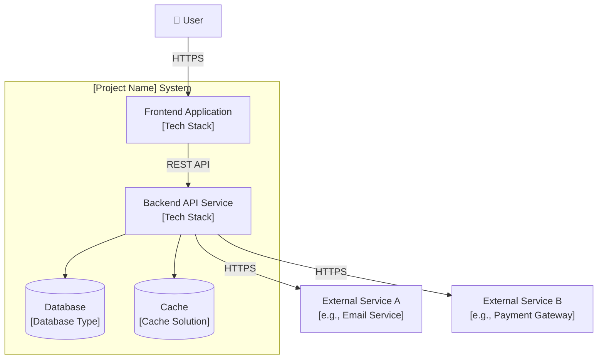
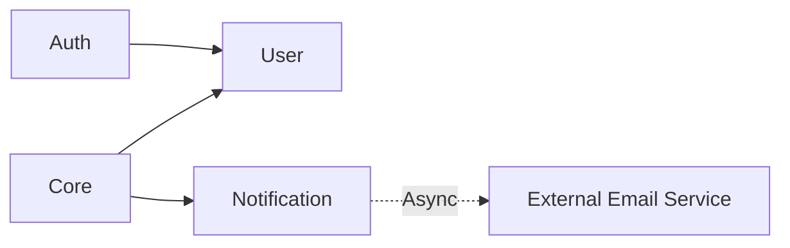

# architecture.md — System Architecture Blueprint

> **Stage**: Plan (Stage 3)
> **Prerequisite**: Written after spec.md is completed
> **Update Timing**: Update synchronously during major architectural changes

---

## System Architecture Diagram

> Using the C4 model is recommended. Below is a Context layer example, which can be expanded to Container / Component layers as needed.



---

## Module Breakdown and Responsibilities

| Module | Responsibility Boundary | External Interfaces | Tech Selection |
| :--- | :--- | :--- | :--- |
| [Module A, e.g. Auth] | [e.g. User auth, authorization, session management] | [e.g. REST API /api/auth/*] | [e.g. JWT + bcrypt] |
| [Module B, e.g. User] | [e.g. User profile CRUD, preferences] | [e.g. REST API /api/users/*] | [e.g. SQLAlchemy ORM] |
| [Module C, e.g. Core] | [e.g. Core business logic] | [e.g. REST API /api/core/*] | [e.g. Domain-Driven Design] |
| [Module D, e.g. Notification] | [e.g. Message notifications, email sending] | [e.g. Internal event-driven] | [e.g. Celery + SMTP] |

### Module Dependencies



> ⚠️ Circular dependencies between modules are prohibited. Dependency directions must strictly follow the diagram above.

---

## Communication Patterns

### Synchronous Calls

| Caller | Callee | Protocol | Scenario |
| :--- | :--- | :--- | :--- |
| Frontend | Backend API | REST / HTTPS | All user requests |
| [Module A] | [Module B] | Function Call | [Scenario Description] |

### Asynchronous Messaging (if applicable)

| Producer | Consumer | Message Queue | Scenario |
| :--- | :--- | :--- | :--- |
| [Module A] | [Module B] | [e.g. Redis Queue / RabbitMQ] | [e.g. Sending email notifications] |

### Event-Driven (if applicable)

| Event Name | Publisher | Subscriber | Trigger Condition |
| :--- | :--- | :--- | :--- |
| `user.registered` | Auth Module | Notification Module | Upon successful user registration |

---

## Data Flow

```
User Request → Frontend → API Gateway/Router → Business Logic Layer → Data Access Layer → Database
                                      ↓
                                Cache Layer (reading hot data)
                                      ↓
                             External Services (called on demand)
```

---

## Key Technical Decisions

> Detailed decision-making processes are recorded in `decisions.md`; only conclusions are listed here.

| Decision Item | Selection | Rationale Summary | ADR ID |
| :--- | :--- | :--- | :--- |
| [e.g. Web Framework] | [e.g. FastAPI] | [e.g. Good async support, excellent performance] | ADR-001 |
| [e.g. ORM] | [e.g. SQLAlchemy 2.0] | [e.g. Mature ecosystem, type safety] | ADR-002 |
| [e.g. Auth Scheme] | [e.g. JWT] | [e.g. Stateless, suitable for API] | ADR-003 |

---

## Architectural Quality Considerations

> Universal quality baselines (performance baselines, security requirements, test coverage) are defined uniformly in `constitution.md`. Only considerations **specific to this architecture** are listed here.

- **Scalability**: [e.g. Module X reserves interfaces for horizontal scaling]
- **Observability**: [e.g. Structured logging + request tracing (request_id throughout the full trace)]
- **Fault Tolerance Boundary**: [e.g. When external service A is unavailable, Module X degrades to local cache mode]
- **Data Consistency**: [e.g. Cross-module operations use transactions / eventual consistency strategy]
