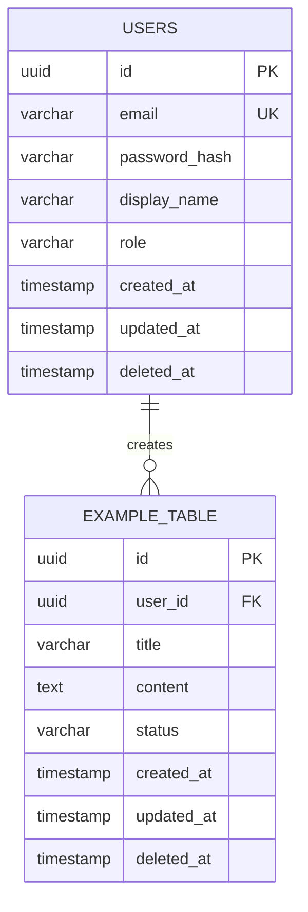

# data-model.md — Authoritative Data Persistence Model

> **Stage**: Plan (Stage 3)
> **Prerequisite**: Written after architecture.md is confirmed
> **Update Timing**: Must be updated synchronously after every Schema change
> **Associated Constraint**: Before AI modifies Database Schema, it must update this file first (see AGENTS.md prohibited behaviors)

---

## ER Diagram

---

## Table Structure Definitions

### users — User Table

| Field | Type | Constraints | Default Value | Description |
| :--- | :--- | :--- | :--- | :--- |
| `id` | UUID | PK, NOT NULL | `gen_random_uuid()` | Primary key |
| `email` | VARCHAR(255) | UNIQUE, NOT NULL | — | Login email |
| `password_hash` | VARCHAR(255) | NOT NULL | — | Password hash (bcrypt) |
| `display_name` | VARCHAR(100) | NOT NULL | — | Display name |
| `role` | VARCHAR(20) | NOT NULL | `'user'` | Role: user / admin |
| `created_at` | TIMESTAMP | NOT NULL | `NOW()` | Creation time |
| `updated_at` | TIMESTAMP | NOT NULL | `NOW()` | Update time |
| `deleted_at` | TIMESTAMP | NULLABLE | `NULL` | Soft delete marker |

**Indexes**:
- `idx_users_email` — UNIQUE on `email` (login query)
- `idx_users_role` — on `role` (filter by role)

---

### [example_table] — [Table Description]

| Field | Type | Constraints | Default Value | Description |
| :--- | :--- | :--- | :--- | :--- |
| `id` | UUID | PK, NOT NULL | `gen_random_uuid()` | Primary key |
| `user_id` | UUID | FK → users.id, NOT NULL | — | Owning user |
| `title` | VARCHAR(200) | NOT NULL | — | Title |
| `content` | TEXT | NULLABLE | — | Content |
| `status` | VARCHAR(20) | NOT NULL | `'draft'` | Status enum |
| `created_at` | TIMESTAMP | NOT NULL | `NOW()` | Creation time |
| `updated_at` | TIMESTAMP | NOT NULL | `NOW()` | Update time |
| `deleted_at` | TIMESTAMP | NULLABLE | `NULL` | Soft delete marker |

**Indexes**:
- `idx_example_user_id` — on `user_id` (query by user)
- `idx_example_status` — on `status` (filter by status)

---

## General Conventions

### Audit Fields

All tables must include the following fields:
- `created_at`: Records creation time, NOT NULL, default `NOW()`
- `updated_at`: Records update time, NOT NULL, default `NOW()`, auto-refreshed on every update

### Soft Deletion

- Use `deleted_at` field to mark deletion, `NULL` indicates not deleted
- Default filter `WHERE deleted_at IS NULL` when querying
- Prohibit physical deletion of user data (see constitution.md)

### Primary Key Strategy

- Default recommendation is UUID v4 (prevents ID enumeration attacks, suitable for distributed scenarios)
- Generation method: [e.g. PostgreSQL `gen_random_uuid()` / App layer `uuid4()` / ULID]
- If the project has special requirements (like high write performance), auto-increment IDs or ULID can be chosen, must record reasons in `decisions.md`

---

## Data Migration Strategy

- Migration tool: [e.g. Alembic / Prisma Migrate / Flyway]
- Naming convention: `YYYYMMDD_HHMMSS_<description>.sql`
- Each migration must include UP and DOWN scripts
- Migration scripts must be tested for rollback locally before committing

---

## Enum Definitions

| Table | Field | Allowed Values | Description |
| :--- | :--- | :--- | :--- |
| users | role | `user`, `admin` | User roles |
| [Table] | status | `draft`, `active`, `archived` | [Description] |
