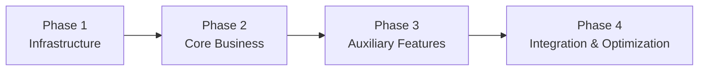

# plan.md — Technical Implementation Path

> **Stage**: Plan (Stage 3)
> **Prerequisite**: Written after architecture.md + data-model.md + contracts/ are completed
> **Nature**: Bridge connecting architecture and task breakdown, focuses on "how to implement"
> **Update Timing**: Sync updates when technical plans adjust

---

## Tech Stack Details

> Core tech stack constraints (language, primary framework, database) are defined in `constitution.md`. This details **version locking** and **auxiliary toolchains**.

| Category | Technology | Version | Purpose |
| :--- | :--- | :--- | :--- |
| Runtime | [e.g. Python] | [e.g. 3.12.x] | Server runtime (see constitution) |
| Web Framework | [e.g. FastAPI] | [e.g. 0.115.2] | HTTP routing and request processing (see constitution) |
| ORM | [e.g. SQLAlchemy] | [e.g. 2.0.35] | Database access |
| Migration Tool | [e.g. Alembic] | [e.g. 1.13.1] | Schema version management |
| Task Queue | [e.g. Celery] | [e.g. 5.4] (if applicable) | Asynchronous task processing |
| Test Framework | [e.g. pytest] | [e.g. 8.3.x] | Automated testing |
| Containerization| [e.g. Docker] | [e.g. 24.x] | Environment consistency |

---

## Module Implementation Order

> Defines the **technical implementation sequence** (what to build first, then what next), focusing on dependency chains.
> Business-level **delivery timelines and milestone planning** are handled by `roadmap.md`; the two complement each other without duplication.



### Phase 1: Infrastructure Setup

1. Project scaffolding initialization (directory structure, dependency management, config system)
2. Database connections and ORM configuration
3. Database migration scaffolding
4. Core middleware (logging, error handling, CORS)
5. Health check endpoints

### Phase 2: Core Business Implementation

1. [Core Module A, e.g.: User Auth (Registration/Login/Token management)]
2. [Core Module B, e.g.: Core business CRUD]
3. [Core Module C, e.g.: Access control]

### Phase 3: Auxiliary Features

1. [Auxiliary Feature A, e.g.: Email notifications]
2. [Auxiliary Feature B, e.g.: File uploads]
3. [Auxiliary Feature C, e.g.: Data exports]

### Phase 4: Integration & Optimization

1. End-to-end testing
2. Performance optimization (caching, query optimization)
3. Deployment configurations (Docker / CI/CD)

---

## Third-Party Service Integration Plan

| Service | Provider | Purpose | Integration Method | Fault Tolerance Strategy |
| :--- | :--- | :--- | :--- | :--- |
| [e.g. Email] | [e.g. SendGrid] | Auth emails/notifications | REST API | Retry 3 times, timeout 10s |
| [e.g. Storage]| [e.g. S3] | File/image storage | SDK | Local fallback |
| [e.g. Payment]| [e.g. Stripe] | Order payments | Webhook | Idempotent processing |

---

## Error Handling Strategy

### Global Error Handling

```
Request → Middleware catches exception → Unified error response format → Logging
```

### Error Classification

| Level | Handling Method | Examples |
| :--- | :--- | :--- |
| Business Error | Return specific error code, frontend displays | Email already registered, insufficient balance |
| Validation Error | Return 422 + field-level error details | Missing required fields, format error |
| System Error | Return 500, log alert | DB connection failed, third-party timeout |

### Logging Strategy

- Format: JSON structured logging
- Levels: ERROR / WARN / INFO / DEBUG
- Required fields: `timestamp`, `level`, `request_id`, `module`, `message`
- Sensitive information (passwords, Tokens) are prohibited from appearing in logs

---

## Key Business Flow Implementation Approach

### [Flow Name, e.g.: User Registration Flow]

```
1. Receive registration request → Validate parameters
2. Check if email is registered → If registered, return 409
3. Hash password (bcrypt)
4. Write to database
5. Trigger "Send verification email" async task
6. Return user info (excluding password)
```

### [Flow Name, e.g.: Order Payment Flow]

```
[Fill in based on actual business flow]
```

---

> **Note**: Specific definitions of API interfaces (paths, request/response structures) are handled by `contracts/`; this file does not repeat them.
