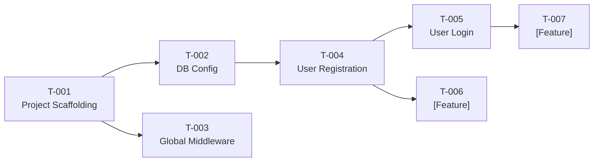

# tasks.md — Atomic Action Checklist

> **Stage**: Tasks (Stage 4)
> **Prerequisite**: Broken down based on plan.md + roadmap.md
> **Execution Rule**: AI executes only one task at a time, checks it off here when done; batch execution is prohibited
> **Granularity**: S (30min-1h) / M (1-2h) / L (2-4h) / XL (4h+, requires breakdown or human approval), acceptance methods must be runnable commands

---

## Current Iteration: [Milestone Name, e.g. M2 - Core MVP]

### Infrastructure

- [ ] **T-001**: Initialize project scaffolding (Linked to M1)
  - Description: Create project directory structure, install core dependencies, configure linter/formatter
  - Affected files: `pyproject.toml`, `src/__init__.py`, `.ruff.toml`
  - Acceptance: `[Test command, e.g. python -c "import fastapi; print(fastapi.__version__)"]` outputs version normally
  - Complexity: S | Dependencies: None

- [ ] **T-002**: Configure database connection and ORM (Linked to M1)
  - Description: Configure DB connection pool, create Base Model, setup Alembic migrations
  - Affected files: `src/database.py`, `src/models/base.py`, `alembic/`
  - Acceptance: `[e.g. alembic upgrade head]` executes successfully + `[e.g. pytest tests/test_db.py -v]` all pass
  - Complexity: M | Dependencies: T-001

- [ ] **T-003**: Implement global middleware (Linked to M1)
  - Description: Error handling middleware, request logging middleware, CORS configuration
  - Affected files: `src/middleware/`, `src/main.[ext]`
  - Acceptance: `[e.g. curl http://localhost:8000/health]` returns 200 + logs output correctly
  - Complexity: S | Dependencies: T-001

### Core Business

- [ ] **T-004**: Implement user registration API (Linked to F-001, AC-001-01~03)
  - Description: POST /api/auth/register, including param validation, email uniqueness check, password hashing, DB write
  - Affected files: `src/auth/router.py`, `src/auth/service.py`, `tests/test_auth.py`
  - Acceptance: `[e.g. pytest tests/test_auth.py::test_register -v]` all pass
  - Complexity: M | Dependencies: T-002

- [ ] **T-005**: Implement user login API (Linked to F-002, AC-002-01~02)
  - Description: POST /api/auth/login, including credential validation, JWT Token generation
  - Affected files: `src/auth/router.py`, `src/auth/jwt.py`, `tests/test_auth.py`
  - Acceptance: `[e.g. pytest tests/test_auth.py::test_login -v]` all pass
  - Complexity: M | Dependencies: T-004

- [ ] **T-006**: [Feature Description] (Linked to F-XXX, AC-XXX-XX)
  - Description: [Specific implementation details]
  - Affected files: [List of files to create/modify]
  - Acceptance: `[Test command]`
  - Complexity: [S/M/L/XL] | Dependencies: [T-XXX]

### Auxiliary Features

- [ ] **T-007**: [Feature Description] (Linked to F-XXX)
  - Description: [Specific implementation details]
  - Affected files: [List of files to create/modify]
  - Acceptance: `[Test command]`
  - Complexity: [S/M/L/XL] | Dependencies: [T-XXX]

---

## Task Dependencies

---

## Statistics

| Complexity | Count | Est. Total Time | Process Requirements |
| :--- | :--- | :--- | :--- |
| S (30min-1h) | [X] | [X]h | AGENTS.md is sufficient |
| M (1-2h) | [X] | [X]h | Must link spec + tasks |
| L (2-4h) | [X] | [X]h | Must follow full 5 stages |
| XL (4h+) | [X] | [X]h | Full 5 stages + decisions + security review |
| **Total** | **[X]** | **[X]h** | |

---

<!--
Template tips:
- ID Rule: T-XXX, incremental, unique
- Each task must be linked to a feature ID (F-XXX) or acceptance criteria (AC-XXX-XX) in the spec
- Acceptance methods cannot be vague descriptions like "tests pass"; they must be runnable commands
- When adding new tasks, append under the relevant category, update stats and dependency graph
-->
